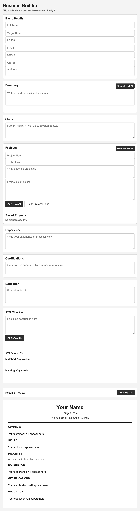

# AI Resume Builder with ATS Checker

AI-powered resume builder with ATS analysis, real-time preview, and intelligent content generation.

## Preview


## Tech Stack
- Python (Flask)
- JavaScript
- HTML, CSS
- Gemini API (AI integration)

## Features
- Real-time resume preview
- AI-generated professional summary
- AI-generated project descriptions
- ATS keyword analysis with score
- Add, edit, and delete multiple projects
- Clean PDF export
- Typing animation for AI responses

## Run

### Mac/Linux
```bash
python3 -m venv venv
source venv/bin/activate
pip install -r requirements.txt
cp .env.example .env
python3 app.py
```

### Windows
```powershell
python -m venv venv
venv\Scripts\activate
pip install -r requirements.txt
copy .env.example .env
python app.py
```
